  <picture>
    
  </picture>

 

  
  &nbsp;
  
  &nbsp;
  
  &nbsp;
  

 

  <h1>Hi, I'm Himanshu Shakya </h1>
  <h3>Engineering the Intersection of Hardware & Software</h3>
  
   
  
  

 

  <blockquote>
    

      I am an <strong>Electronics Engineer</strong> and <strong>Full Stack Developer</strong> focused on building robust, scalable applications. My work spans the entire stack—from configuring microcontrollers and IoT devices to architecting complex cloud-native web solutions. I specialize in optimizing performance and creating seamless user experiences across digital and physical interfaces.
    

  </blockquote>

 

## 🛠️ Technical Expertise

  
  <table>
    <tr>
      <td valign="top" width="50%">
        <h3>💻 Core Languages</h3>
        
Foundational languages for systems and scripting.

        
      </td>
      <td valign="top" width="50%">
        <h3>🌐 Frontend Ecosystem</h3>
        
Building responsive and interactive UIs.

        
      </td>
    </tr>
    <tr>
      <td valign="top" width="50%">
        <h3>⚙️ Backend & Database</h3>
        
Server-side logic and data persistence.

        
      </td>
      <td valign="top" width="50%">
        <h3>🔌 IoT, DevOps & Creative</h3>
        
Hardware, creative tools, and workflow.

        
      </td>
    </tr>
  </table>

 

## 📈 Contributions & Activity
 

  

 

  

