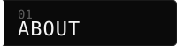
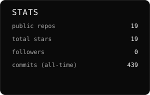
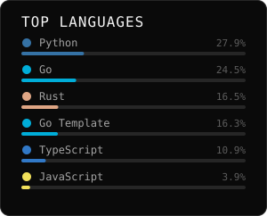
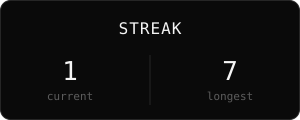

  

 

  

  <code>MODE: BUILDING STRANGE SYSTEMS</code>&nbsp;&nbsp;·&nbsp;&nbsp;<code>RUNTIME: FIRMWARE → DISTRIBUTED SYSTEMS</code>

  <a href="#about">01 / ABOUT</a>&nbsp;&nbsp;·&nbsp;&nbsp;
  <a href="#stack">02 / STACK</a>&nbsp;&nbsp;·&nbsp;&nbsp;
  <a href="#projects">03 / PROJECTS</a>&nbsp;&nbsp;·&nbsp;&nbsp;
  <a href="#stats">04 / STATS</a>

 

  

> I build systems with sharp edges: AI agents that behave like organisms, cryptography that assumes the future is hostile, and software that keeps a live signal moving when the network does not.

I’m an **Electronics Engineer** and **Full Stack Developer** working across the entire stack — from firmware and IoT devices to production web systems. The common thread is curiosity about what happens underneath the interface: how systems communicate, fail, recover, and become useful in the real world.

 

<table>
  <tr>
    <td><code>FOCUS</code> AI systems · secure communication · IoT</td>
    <td><code>STYLE</code> systems thinking · fast prototypes · hard edges</td>
    <td><code>STATUS</code> shipping, learning, refining</td>
  </tr>
</table>

 

  

<table>
  <tr>
    <td width="50%" valign="top">
      <strong>LANGUAGES</strong>  
      <code>TypeScript</code> <code>Python</code> <code>Rust</code> <code>Go</code> 
      <code>C</code> <code>C++</code> <code>Java</code> <code>JavaScript</code> 
      <code>Dart</code> <code>Bash</code>
    </td>
    <td width="50%" valign="top">
      <strong>PRODUCT SYSTEMS</strong>  
      <code>React</code> <code>Next.js</code> <code>Vite</code> <code>Flutter</code> 
      <code>Tailwind</code> <code>Node.js</code> <code>NestJS</code> 
      <code>GraphQL</code> <code>FastAPI</code> <code>Spring</code>
    </td>
  </tr>
  <tr>
    <td valign="top">
      <strong>INFRASTRUCTURE &amp; DATA</strong>  
      <code>Postgres</code> <code>MongoDB</code> <code>SQLite</code> 
      <code>Prisma</code> <code>Redis</code> <code>Docker</code> 
      <code>Linux</code> <code>Prometheus</code> <code>ChromaDB</code>
    </td>
    <td valign="top">
      <strong>EMBEDDED &amp; CREATIVE</strong>  
      <code>Arduino</code> <code>Raspberry Pi</code> <code>Expo</code> 
      <code>Godot</code> <code>Blender</code> <code>Figma</code> 
      <code>Git</code> <code>Postman</code>
    </td>
  </tr>
</table>

 

  

Five systems worth opening the hood for. Each one starts with a different problem; the interesting part is the shape the solution takes.

 

  
<strong>PROJECT AETHER</strong> · event-driven AI as an organism

   

  [Open Project Aether →](https://github.com/Gamingstein/Project-Aether)

    

  An AI ecosystem for Discord, modelled as a biological organism. Microservices communicate through a Redis Streams nervous system; a compiled LangGraph `StateGraph` acts as the Brain; MCP handles tool discovery; sentiment gives the system a mood layer; ChromaDB supplies asynchronous memory.

   

  `Python` `LangGraph` `Redis` `ChromaDB` `MCP` `Prometheus` `Grafana`

 

  
<strong>AEGIS</strong> · a messenger built for the future threat model

   

  [Open Aegis →](https://github.com/Gamingstein/Aegis)

    

  A post-quantum secure peer-to-peer messenger with a zero-trust architecture. ML-KEM-768 and ML-DSA-65 establish the cryptographic foundation; Double Ratchet provides forward secrecy; encrypted storage, memory zeroization, and an emergency wipe keep the terminal interface backed by serious failure handling.

   

  `Rust` `ML-KEM-768` `ML-DSA-65` `Double Ratchet` `TUI`

 

  
<strong>VITALLINK</strong> · keeping the clinical signal alive

   

  [API](https://github.com/Gamingstein/Vitallink-graphql) · [Dashboard](https://github.com/Gamingstein/Vitallink-frontend) · [Mobile app](https://github.com/Gamingstein/Vitallink-Mobile)

    

  A real-time patient monitoring platform in three connected parts: a GraphQL API, a Next.js dashboard for clinicians, and an Expo/React Native app that brings IoT vitals and AI-driven insights to the point of care.

   

  `TypeScript` `Prisma` `GraphQL` `Next.js` `Expo` `React Native`

 

  
<strong>NEXUS</strong> · infrastructure with a command line

   

  [Open Nexus →](https://github.com/Gamingstein/Nexus)

    

  A dynamic Go developer tool for scaffolding, managing, and stress-testing backend systems. The goal is a faster path from an empty directory to a service that can be exercised under pressure.

   

  `Go` `CLI` `scaffolding` `stress testing`

 

  
<strong>CACHEFLOW</strong> · personal finance without leaving the terminal

   

  [Open Cacheflow →](https://github.com/Gamingstein/Cacheflow)

    

  A production-minded terminal UI for personal finance tracking. Structured data, local persistence, and a focused interface keep the useful parts close to the command line.

   

  `Python` `Textual` `SQLite` `Pydantic`

 

  

  
  
  

Generated daily from GitHub’s API by <a href="scripts/generate_stats.py">a self-hosted stats script</a>. No third-party stats service in the critical path.

 

  <a href="https://www.linkedin.com/in/gamingstein/">LinkedIn</a>&nbsp;&nbsp;·&nbsp;&nbsp;
  <a href="https://x.com/Gamingstein_">X</a>&nbsp;&nbsp;·&nbsp;&nbsp;
  <a href="https://www.youtube.com/@Gamingstein_">YouTube</a>&nbsp;&nbsp;·&nbsp;&nbsp;
  <a href="https://www.instagram.com/Gamingstein_">Instagram</a>&nbsp;&nbsp;·&nbsp;&nbsp;
  <a href="https://leetcode.com/Gamingstein_/">LeetCode</a>

<code>END OF PROFILE // KEEP BUILDING</code>

